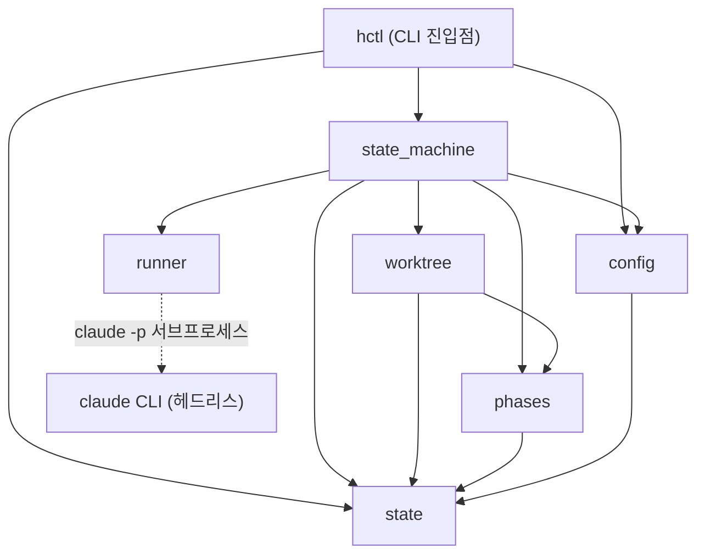
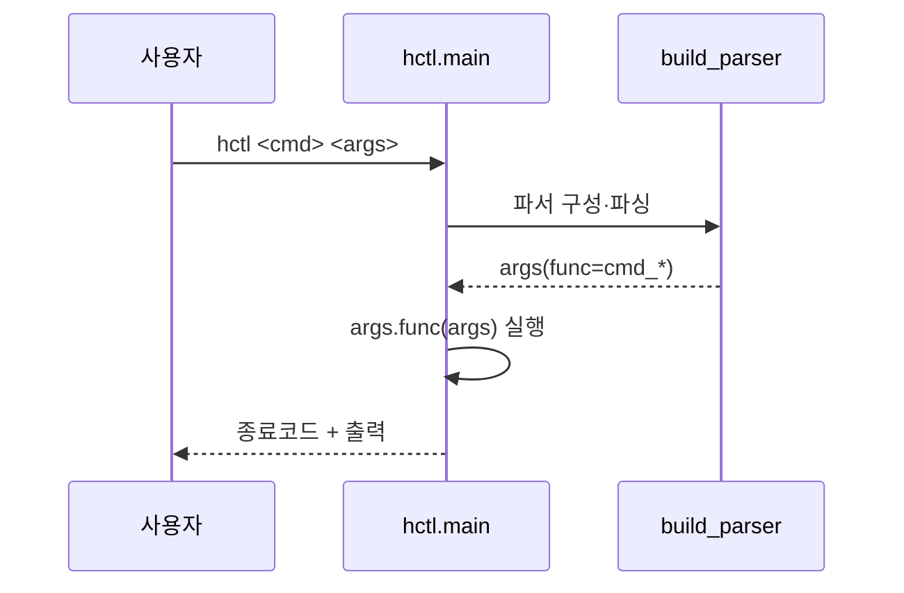
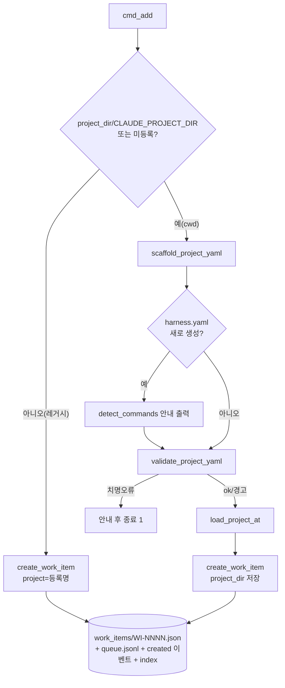
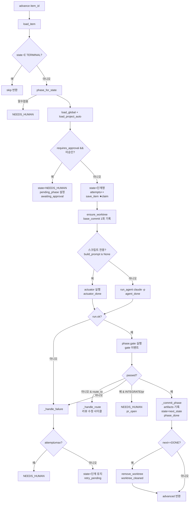
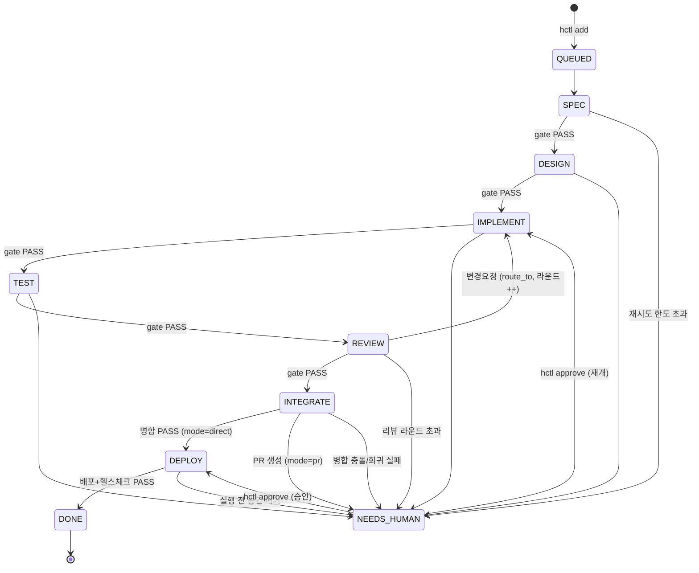
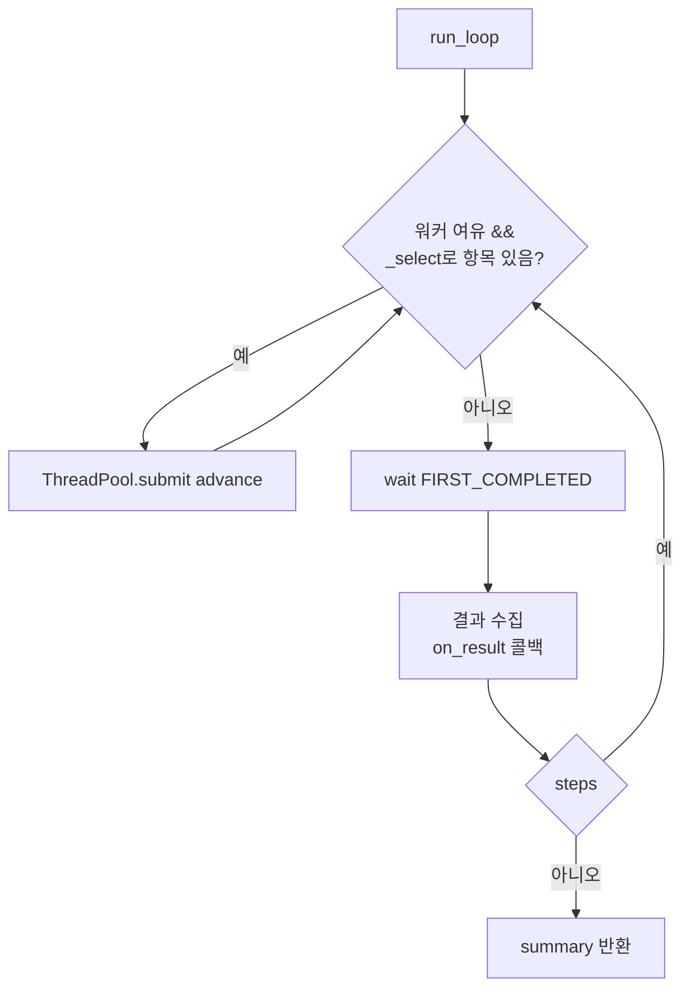
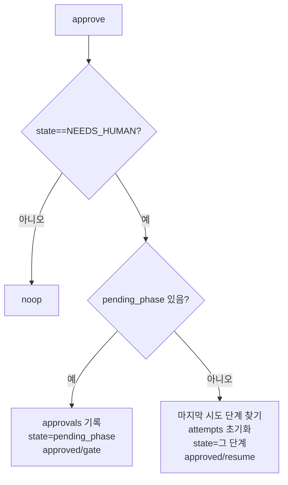
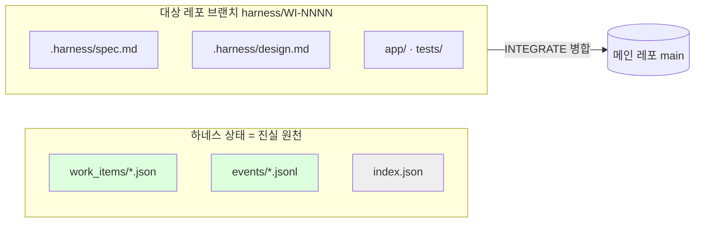

# 코드 전체 흐름 (CODE-FLOW)

> `hctl` + `harness/` 패키지의 모든 코드를 **함수/클래스 단위**로 따라가는 문서.
> (이 문서는 코드에서 직접 재작성했다. 로드맵은 `PROGRESS.md` 별도 참조.)

핵심 원칙: **LLM은 비결정적 작업자, 하네스는 결정적 오케스트레이터.** 상태를 쓰는 곳은
`state.py` 하나뿐이고, 합격 판정은 `phases.py`의 게이트(스크립트)만 한다.

---

## 0. 모듈 의존 그래프



- **단방향**: `hctl → state_machine → {phases, runner, worktree, config, state}`.
- `state`는 모두의 바닥(경로 상수 + 기록자). `runner`만 외부 `claude` 프로세스를 띄운다.

---

## 1. 파일·함수·클래스 레퍼런스

### 1.1 `hctl` — CLI 진입점 (로직 없음, 모듈 호출만)

| 함수 | 한 줄 설명 |
|---|---|
| `main()` | 파서를 만들어 파싱하고 선택된 `args.func(args)` 실행 |
| `build_parser()` | `add/run/status/log/approve/init/projects/reindex/worktrees` 서브커맨드 정의 |
| `cmd_add(args)` | 요구사항 등록. cwd/플러그인 모드면 `harness.yaml` 없을 때 **자동 스캐폴드+검증** 후 항목 생성 |
| `cmd_run(args)` | `--loop`이면 `run_loop()`, 아니면 항목 1개를 `advance()`로 **한 단계** 전진 |
| `cmd_status(args)` | `--item` 상세 또는 `index.json` 기반 전체 목록 |
| `cmd_log(args)` | 항목 이벤트 타임라인(`events/*.jsonl`) 출력 |
| `cmd_approve(args)` | `NEEDS_HUMAN` 항목을 `approve()`로 승인/재개 |
| `cmd_init(args)` | `harness.yaml` 스캐폴드 + git 전제조건 확인 + test 드라이런 |
| `cmd_projects/reindex/worktrees` | 레거시 프로젝트 목록 / 인덱스 복구 / worktree 목록 |
| `_print_result(res)` | `advance`/loop 결과 dict를 사람이 읽는 한 줄로 |
| `_dryrun(cmd,cwd)` | 명령 1회 실행해 종료코드만 반환(init 검증용) |

### 1.2 `harness/state.py` — 상태 저장 계층 (**유일한 기록자**)

| 요소 | 한 줄 설명 |
|---|---|
| `ENGINE_ROOT` | 코드·prompts 위치(구 HARNESS_HOME). 상태는 여기 안 씀 |
| `_resolve_data_root()` / `DATA_ROOT` | 상태 루트 결정: env(`CLAUDE_PLUGIN_DATA`/`HARNESS_DATA_HOME`) → 레거시 in-repo → `~/.harness` |
| `STATE_DIR, WORK_ITEMS_DIR, EVENTS_DIR, QUEUE_FILE, INDEX_FILE, LOCK_FILE` | 상태 파일 경로 상수 |
| `_atomic_write(path,text)` | **tmp 작성→fsync→os.replace**(원자적). 반쪽 파일 불가 |
| `_lock()` | `flock` 기반 배타 락 contextmanager (ID/큐/인덱스 직렬화) |
| `_next_id()` | 기존 파일 스캔해 다음 `WI-NNNN` 발급(락 안에서) |
| `create_work_item(...)` | 항목 JSON 생성 + `queue.jsonl` 기록 + `created` 이벤트 + 인덱스 갱신 |
| `load_item / save_item / list_items / item_exists` | 항목 읽기/원자적 쓰기/전체/존재확인 |
| `append_event(id,kind,data)` | 항목 타임라인에 **append-only** 한 줄 |
| `read_events(id)` | 이벤트 줄들을 파싱해 반환 |
| `_build_index/_reindex_locked/reindex/load_index` | 조회용 `index.json`(파생 캐시) 생성·복원, 손상 시 자동 재생성 |

### 1.3 `harness/config.py` — 설정 로더 + 스캐폴딩

| 함수 | 한 줄 설명 |
|---|---|
| `_deep_merge` | 기본값 위에 사용자 설정을 깊은 병합 |
| `load_global()` | `config.yaml` + 글로벌 기본값(모델/재시도/워커 등) |
| `load_project(name)` | **레거시**: `projects/<name>/harness.yaml` 로드, repo 경로 정규화 |
| `project_id_for(dir)` | 경로 기반 안정 식별자(`이름-해시8`) |
| `load_project_at(dir)` | **cwd/플러그인**: 디렉토리의 `harness.yaml` 로드, repo=그 디렉토리 |
| `load_project_auto(item)` | 항목에 `project_dir` 있으면 cwd 모드, 없으면 레거시 |
| `detect_commands(dir)` | 스택 감지(node scripts/python/go/rust/java/.net/elixir/ruby/php + Makefile)로 명령 추론 |
| `friendly_project_name(dir)` | 디렉토리명 기반 표시 이름 |
| `validate_project_yaml(path)` | `(ok, message)` — 파싱 오류/형식 오류/오타키 경고 |
| `git_status(dir)` | `{is_repo, has_commit}` (하네스는 git 필수) |
| `scaffold_project_yaml(dir,overwrite)` | `harness.yaml` 생성(추론값 채움, `--force`면 `.bak` 백업) |

### 1.4 `harness/phases.py` — 단계 정의 + **게이트**

| 요소 | 한 줄 설명 |
|---|---|
| `PIPELINE` | `[SPEC, DESIGN, IMPLEMENT, TEST, REVIEW, INTEGRATE, DEPLOY]` |
| `TERMINAL` | `{DONE, FAILED, NEEDS_HUMAN}` |
| `class PhaseContext` | 한 단계 실행 컨텍스트(item, project_cfg, repo, artifacts_dir, spec/design 경로) |
| `class GateResult` | 게이트 결과(`passed`, `detail`, `checks`, `route_to`) |
| `class Phase` | 단계 정의(`allowed_tools`, `system`, `build_prompt`, `gate`, `actuator`) |
| `run_shell(cmd,cwd)` | 게이트/액추에이터용 셸 실행 `(rc, 출력)` |
| `git_has_changes / _load_template / _read_spec / _read_design / _extract_json` | 변경감지 / 프롬프트 템플릿 / 산출물 읽기 / 리뷰어 JSON 추출 |
| `_spec_prompt / _spec_gate` | 명세 프롬프트 / 게이트(파일 존재 + 수용기준 ≥3) |
| `_design_prompt / _design_gate` | 설계 프롬프트 / 게이트(접근·파일·인터페이스·경로 섹션) |
| `_implement_prompt / _implement_gate` | 구현 프롬프트(+직전 리뷰 주입) / 게이트(변경발생 + build/lint 통과) |
| `_test_prompt / _test_gate` | 테스트 프롬프트 / 게이트(test 명령 실행 통과) |
| `_review_prompt / _review_gate` | diff 리뷰 프롬프트 / 게이트(테스트 재실행 그린 + 리뷰어 PASS, 실패 시 `route_to=IMPLEMENT`) |
| `_trunk_ref / _reset_trunk / _abort_merge` | 트렁크 ref 탐색 / 트렁크 pristine 강제(reset+clean) / 머지 되돌리기 |
| `_integrate_direct / _integrate_pr / _integrate_actuator / _integrate_gate` | main 직접 병합(+회귀테스트) / PR 생성 / 모드 분기 / 결과 확인 |
| `_deploy_actuator / _deploy_gate` | 배포 명령 실행 / 헬스체크 |
| `requires_approval(phase,cfg)` | 단계 실행 전 사람 승인 필요?(기본 DEPLOY만) |
| `PHASES` | 단계명→`Phase` 레지스트리 |
| `phase_for_state(state)` | 현재 상태→실행할 단계(`QUEUED`→SPEC) |
| `next_state(phase)` | 다음 파이프라인 상태(마지막이면 `DONE`) |

### 1.5 `harness/runner.py` — 비결정적 작업자 호출

| 요소 | 한 줄 설명 |
|---|---|
| `class RunResult` | 에이전트 실행 결과(`ok, text, raw, cost_usd, num_turns, error`) |
| `run_agent(...)` | `claude -p --output-format json` 헤드리스 실행, 도구/모델/권한/타임아웃 적용. **판정은 안 함** |

### 1.6 `harness/worktree.py` — 동시 처리 격리

| 함수 | 한 줄 설명 |
|---|---|
| `ensure_baseline(repo)` | 메인 레포가 git이고 최소 1커밋 갖도록 보장 |
| `ensure_worktree(repo,proj,id,branch)` | 항목 worktree 생성/반환(트렁크에서 분기). `_wt_lock`으로 직렬화 |
| `remove_worktree(...)` | worktree 디렉토리 제거(브랜치/커밋은 보존) |
| `worktree_path / list_worktrees / _trunk_ref` | 경로 계산 / 목록 / 트렁크 탐색 |

### 1.7 `harness/state_machine.py` — 결정적 오케스트레이터

| 함수 | 한 줄 설명 |
|---|---|
| `advance(item_id)` | **항목 1개를 정확히 한 단계 전진**(핵심). 아래 §2.3 |
| `_commit_phase(repo,id,phase,summary)` | 단계 통과 후 worktree 브랜치에 `git add -A` + 커밋 |
| `_handle_route(...)` | 게이트 `route_to`(리뷰 변경요청)→되돌림. 라운드 한도 초과 시 NEEDS_HUMAN |
| `_handle_failure(...)` | 실패→재시도(같은 단계 유지) 또는 한도 초과 시 NEEDS_HUMAN |
| `pick_next()` | 단일 실행용: 우선순위/오래된 순 비종료 항목 1개 |
| `_project_cap / _select / run_loop(...)` | 프로젝트 동시 한도 / 다음 항목 선택 / **ThreadPool 동시 처리 루프** |
| `approve(item_id)` | NEEDS_HUMAN 해제: 승인대기(pending_phase)면 허가, 실패성이면 마지막 단계 재개 |

---

## 2. 실행 흐름

### 2.1 명령 진입



### 2.2 `hctl add` (cwd/플러그인 모드 — 스캐폴드 포함)



### 2.3 `advance()` — 한 단계 전진 (★ 핵심)



핵심 포인트:
- **claim이 실행보다 먼저**다: `state=단계명` + `attempts++`를 **에이전트 호출 전에** 저장한다 → 중단돼도 "이 단계를 1회 시도했다"가 남는다(무한루프 방지).
- 게이트는 항상 **스크립트**(`run_shell`로 실제 빌드/테스트 실행). 에이전트 자기보고를 안 믿는다.

### 2.4 파이프라인 상태도



### 2.5 `run --loop` 동시 처리


- 항목당 한 번에 하나의 `advance`만(busy 집합). 프로젝트별 `concurrency` 한도 준수.
- 각 항목은 자신의 **worktree**에서 돌아 작업 트리 충돌이 없다.

### 2.6 `approve`



---

## 3. 단계별 생성/수정 파일 + 의미

매 `advance` 단계는 **두 곳**에 쓴다: ① 하네스 상태(`DATA_ROOT/state/`) ② 항목 worktree(대상 레포 브랜치).

### 3.1 항상 갱신되는 하네스 상태 파일

| 파일 | 시점 | 의미 |
|---|---|---|
| `state/work_items/WI-NNNN.json` | claim·전이마다 (원자적 교체) | **진실 원천** — 현재 단계·시도·산출물·승인·오류 |
| `state/events/WI-NNNN.jsonl` | 이벤트마다 append | **감사 로그** — created/phase_start/agent_done/gate/phase_done/… |
| `state/queue.jsonl` | `add` 시 append | 요구사항 인입 로그 |
| `state/index.json` | save/create마다 | 조회용 **파생 캐시**(손상돼도 reindex로 복원) |

### 3.2 단계별 worktree 산출물(대상 레포 브랜치 `harness/WI-NNNN`)

| 단계 | 생성/수정 파일 | 수정의 의미 |
|---|---|---|
| SPEC | `<repo>/.harness/<id>/spec.md` | 수용 기준 명세(이후 모든 단계가 읽는 계약) |
| DESIGN | `<repo>/.harness/<id>/design.md` | 기술 설계(구현/리뷰의 기준) |
| IMPLEMENT | `<repo>/app/...` 등 서비스 코드 | 실제 기능 구현(+직전 리뷰 피드백 반영) |
| TEST | `<repo>/tests/...` 테스트 코드 | 수용 기준을 검증하는 테스트 |
| (각 단계 통과) | 브랜치에 **커밋 1개** (`_commit_phase`) | "이 단계 산출물 확정" — 되돌림/추적 단위 |
| REVIEW | (파일 없음, 읽기 전용) | 독립 리뷰어가 diff 검토 → JSON 판정 |
| INTEGRATE | **메인 레포 `main`에 병합 커밋** (direct) 또는 **원격 PR** (pr) | 결과를 트렁크에 반영해 사이클을 닫음 |
| DEPLOY | (배포 명령의 외부 효과) | 사람 승인 후 결정적 배포 + 헬스체크 |
| DONE | worktree 디렉토리 제거 | 정리(브랜치/커밋은 보존) |



---

## 4. 중단 & 재개 (★ 따로 상세)

> "갑자기 끊겼다"가 안전한 이유와, 재시작 시 정확히 어디서 이어지는지.

### 4.1 끊겨도 안전한 3가지 설계 불변식

1. **원자적 항목 쓰기** — `_atomic_write`는 tmp→fsync→`os.replace`. 어떤 순간 크래시해도
   `WI-NNNN.json`은 **이전 완전본 또는 새 완전본** 중 하나다(반쪽 없음).
2. **append-only 이벤트** — 이벤트는 보조 감사 로그. 진실은 항목 JSON이라, 마지막 이벤트
   한 줄이 잘려도 **재개 판단에는 영향 없다**.
3. **파생 인덱스 자동 복원** — `index.json`이 깨지면 `load_index`가 `reindex`로 항목
   파일들에서 즉시 재생성. (`hctl reindex`로 수동 복원도 가능)

### 4.2 "claim이 실행보다 먼저" → 재개의 핵심

`advance`는 에이전트를 부르기 **전에** `state=단계명` + `attempts[단계]++`를 저장한다.
따라서 어디서 끊겨도 항목은 **그 단계 상태로** 남고, 다음 `hctl run`이 **같은 단계를
처음부터 다시** 실행한다. 시도 횟수가 이미 올라가 있어 **무한 재시도가 안 된다**
(`max_attempts` 초과 시 `NEEDS_HUMAN`).

### 4.3 끊긴 위치별 결과

| 끊긴 지점 | 상태 파일 | worktree | 재개 시 동작 |
|---|---|---|---|
| claim 직후(에이전트 전) | `state=단계`, attempt=1 | 변화 없음 | 그 단계 재실행(attempt 2) |
| 에이전트 실행 중 | `state=단계`(이미 저장) | 일부 파일 생성됐을 수 있음 | 같은 worktree에서 단계 재실행 → `git add -A`가 잔여 흡수 |
| 게이트 검증 중 | `state=단계` | 산출물 존재 | 재실행(게이트는 부작용 없음) |
| 커밋 직전 | `state=단계` | 파일 있음·미커밋 | 재실행 후 `_commit_phase`가 묶어 커밋 |
| 커밋 후·save 전 (극히 좁은 창) | `state=단계`(아직 이전 단계) | **커밋 생김** | 그 단계 재실행. SPEC/DESIGN/TEST 게이트는 산출물·테스트 기준이라 다시 통과. ⚠️ **IMPLEMENT만 주의**: 게이트가 `git_has_changes`를 요구하는데 이미 커밋돼 작업트리가 깨끗하면, 에이전트가 새 변경을 안 만들 경우 "변경 없음"으로 실패→재시도할 수 있다 |
| save 후 | `state=다음 단계` | 커밋 확정 | 다음 단계부터 진행 |
| DONE 직후 worktree 정리 실패 | `state=DONE` | 폴더 남을 수 있음 | 무해(브랜치 보존). 수동/다음 정리 |

### 4.4 단계별 특수 사항

- **INTEGRATE(direct) 도중 강제 종료** — 메인 레포가 머지 진행 상태(MERGE_HEAD)로
  남을 수 있다. 그러나 `_integrate_direct`는 **시작 시 `checkout 트렁크` + `_reset_trunk`
  (reset --hard + clean)** 를 하므로 다음 실행에서 **자가 치유**된다(중단된 머지 폐기 후 재시도).
- **DEPLOY 도중 종료** — 배포 명령의 **외부 부작용은 트랜잭션이 아니다**. 재개 시 DEPLOY가
  다시 실행되므로, 배포 명령은 **멱등**하게 작성하는 것이 안전(현재 한계, 롤백은 미구현).
- **REVIEW 수정 사이클** — `route_to=IMPLEMENT`로 되돌아갈 때 `review_rounds`가 올라가고
  IMPLEMENT/TEST/REVIEW 시도횟수가 초기화된다. 한도 초과 시 `NEEDS_HUMAN`.

### 4.5 동시 처리(run_loop) 중단

- `in_flight` 미래(future)는 프로세스와 함께 사라지지만, 각 항목 상태는 디스크에 있다.
  재시작하면 `_select`가 **비종료 항목**을 다시 집어 이어서 처리한다(claim된 항목은 그 단계 재실행).
- ⚠️ **한계**: busy/in_flight 집합은 **프로세스 내부**에만 있다. 서로 다른 `hctl run`을
  **동시에 두 개** 띄우면 같은 항목을 중복 처리할 수 있다(파일 락은 ID/큐/인덱스 쓰기만 보호,
  `advance` claim은 보호하지 않음). → **단일 run 프로세스 가정.**

### 4.6 재시작 방법 (요약)

```bash
hctl status                 # 어디서 멈췄는지 (state별)
hctl log WI-NNNN            # 마지막 이벤트로 원인 확인
hctl run --item WI-NNNN     # 그 항목 한 단계 이어서
hctl run --loop             # 비종료 항목 전부 자동 진행 (DEPLOY 승인/실패에서 멈춤)
hctl approve WI-NNNN        # NEEDS_HUMAN 해제(승인 또는 재개)
hctl reindex                # index.json 깨졌을 때 복원
```

핵심: **상태는 전부 `DATA_ROOT/state/`에 있고 멱등 재실행이 안전**하므로, 그냥
`hctl run`을 다시 부르면 멈춘 단계부터 이어진다. 별도 복구 절차가 거의 필요 없다.
