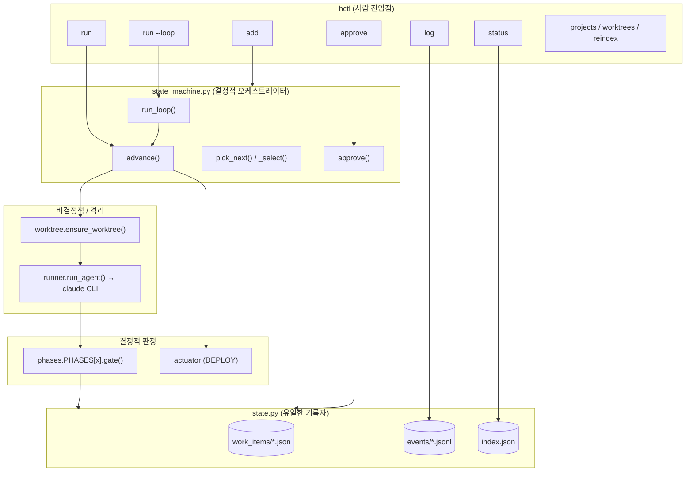
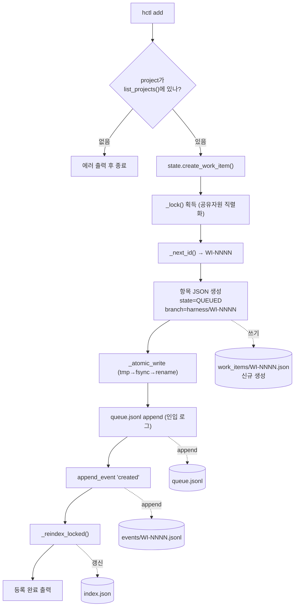
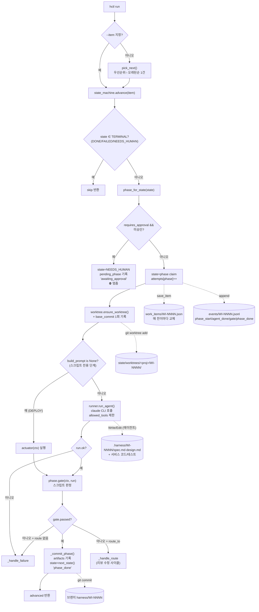
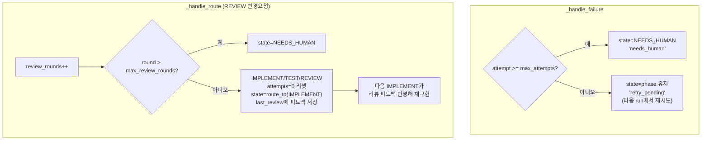
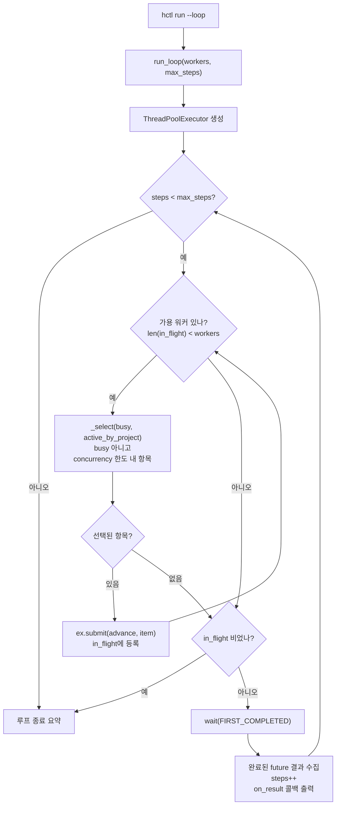
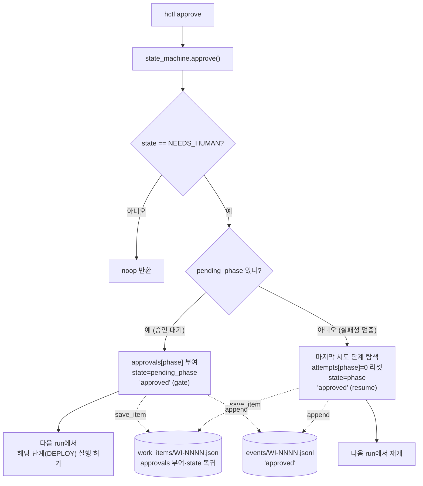
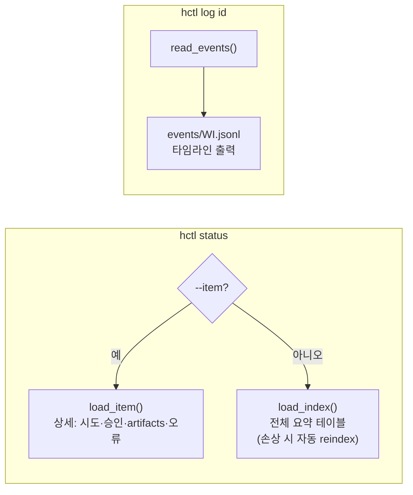
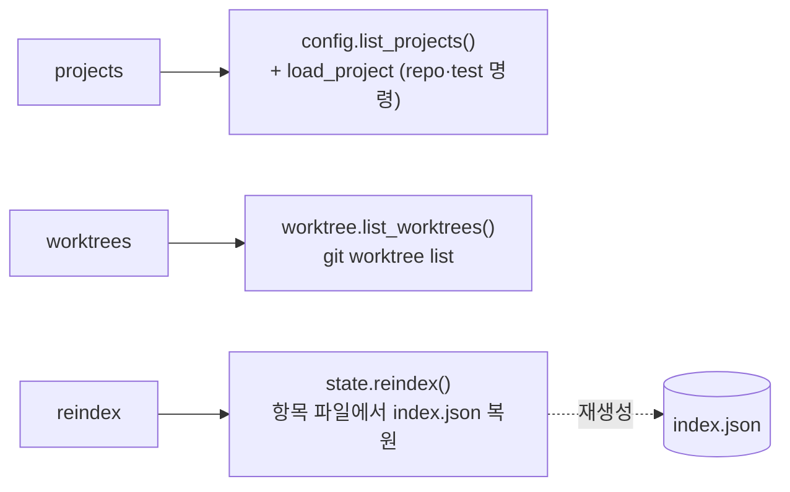
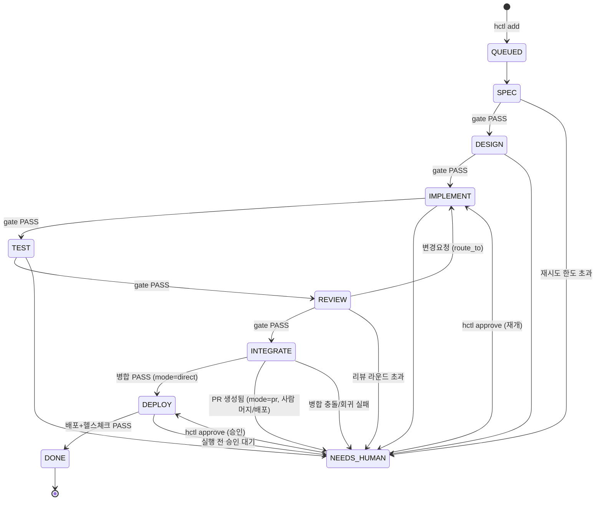

# 명령어별 처리 흐름 (Mermaid)

> `hctl`의 각 명령이 코드 단위(함수/모듈)로 어떻게 처리되는지 도식화한 문서.
> VS Code의 Mermaid 프리뷰(또는 GitHub)에서 렌더링해 볼 것.
>
> 핵심 원칙: **상태 변경은 `state.py`만**, **합격 판정은 `gate` 함수만**, **코드 생성은 `runner`(Claude)만**.
>
> 각 흐름 끝의 **📁 생성/수정 파일** 표기는 그 명령이 디스크에 무엇을 쓰는지 나타낸다.

---

## 0-A. 파일 맵 — 어떤 함수가 어떤 파일을 건드리나

| 파일/디렉토리 | 쓰는 함수 | 읽는 함수 | 성격 |
|---|---|---|---|
| `state/work_items/WI-NNNN.json` | `create_work_item`, `save_item` (→ `_atomic_write`) | `load_item`, `list_items` | **진실 원천** (원자적 교체) |
| `state/events/WI-NNNN.jsonl` | `append_event` (O_APPEND) | `read_events` | **진실 원천** (감사 로그) |
| `state/queue.jsonl` | `create_work_item` (append) | — | 인입 로그 (append-only) |
| `state/index.json` | `_reindex_locked`, `reindex` | `load_index` | 파생 캐시 (재생성 가능) |
| `state/.lock` | `_lock` (flock) | `_lock` | 동시성 직렬화용 |
| `state/worktrees/<proj>/<item>/` | `ensure_worktree` (git worktree add) | 단계 실행 cwd | 항목별 격리 작업 트리 |
| 브랜치 `harness/WI-NNNN` | `ensure_worktree`, `_commit_phase` (git commit) | `_review_prompt` (diff) | 항목별 커밋 이력 |
| `<repo>/.harness/<item>/spec.md` | SPEC 에이전트 (Write) | DESIGN/IMPLEMENT/TEST/REVIEW 프롬프트 | 단계 산출물 |
| `<repo>/.harness/<item>/design.md` | DESIGN 에이전트 (Write) | IMPLEMENT/REVIEW 프롬프트 | 단계 산출물 |
| `<repo>/` 서비스 코드·테스트 | IMPLEMENT/TEST 에이전트 (Write/Edit) | TEST/REVIEW 게이트 (실행) | 실제 결과물 |

> 규율: `state/` 의 파일은 **오직 `state.py`** 가 쓴다. 에이전트(Claude)는 worktree 안의
> `.harness/*.md` 와 서비스 코드만 쓰고, 상태 파일은 절대 직접 쓰지 않는다.

---

## 0. 전체 개요 (계층)

---

## 1. `hctl add <project> "<req>"` — 요구사항 등록

**📁 생성/수정 파일**
- 🆕 `state/work_items/WI-NNNN.json` (state=QUEUED)
- ➕ `state/queue.jsonl` (인입 1줄 추가)
- ➕ `state/events/WI-NNNN.jsonl` (`created` 이벤트)
- ✏️ `state/index.json` (요약 갱신)

---

## 2. `hctl run [--item]` — 한 단계 전진 (핵심)

**📁 단계별 생성/수정 파일** (어떤 단계를 도는지에 따라 다름)

| 단계 | 에이전트가 쓰는 파일 (worktree 내) | 상태머신이 쓰는 파일 (`state/`) |
|---|---|---|
| SPEC | `.harness/WI-NNNN/spec.md` | work_item.json, events.jsonl |
| DESIGN | `.harness/WI-NNNN/design.md` | 〃 |
| IMPLEMENT | 서비스 코드(`app/*.py` 등) | 〃 (+ build/lint는 읽기만) |
| TEST | 테스트 파일(`tests/*.py`) | 〃 |
| REVIEW | (없음 — 읽기 전용) | 〃 (테스트 재실행은 읽기) |
| INTEGRATE | (없음 — actuator가 메인 레포에서 병합/PR) | 〃 (+ 메인 레포 `main`에 머지 커밋) |
| DEPLOY | (없음 — actuator가 deploy 명령 실행) | 〃 |

- 매 단계: ✏️ `work_items/WI-NNNN.json`(claim·전이), ➕ `events/WI-NNNN.jsonl`(여러 이벤트), ✏️ `index.json`
- 게이트 통과 시: 🌿 `harness/WI-NNNN` 브랜치에 커밋 (`_commit_phase`)
- 첫 실행 시: 🆕 `state/worktrees/<proj>/WI-NNNN/` worktree 생성

### 2-1. 실패/되돌림 분기 상세

**📁 생성/수정 파일** (둘 다 `state.py` 경유)
- ✏️ `state/work_items/WI-NNNN.json` (state=NEEDS_HUMAN / 재시도 유지 / route_to 변경, `last_review` 저장)
- ➕ `state/events/WI-NNNN.jsonl` (`needs_human` / `retry_pending` / `review_changes`)
- ✏️ `state/index.json`

---

## 3. `hctl run --loop --workers N` — 동시 처리

> 각 워커는 결국 `advance()` 1스텝을 실행 → 한 항목이 SPEC→…→DEPLOY까지 가려면 여러 번
> picked & advanced 된다. 항목끼리는 worktree로 격리되어 병렬 안전.

**📁 생성/수정 파일**
- `run_loop` 자체는 파일을 직접 쓰지 않음 — 각 `advance()`가 §2와 동일하게 씀
- 항목마다 **서로 다른** `work_items/WI-xxxx.json` · `events/WI-xxxx.jsonl` · worktree 를 쓰므로 충돌 없음
- 공유 파일(`index.json`, `queue.jsonl`)은 `state._lock()`(flock)으로 직렬화

---

## 4. `hctl approve <id>` — NEEDS_HUMAN 해제

**📁 생성/수정 파일**
- ✏️ `state/work_items/WI-NNNN.json` (`approvals` 추가 또는 `attempts` 리셋, state 변경)
- ➕ `state/events/WI-NNNN.jsonl` (`approved`)
- ✏️ `state/index.json`
- ⚠️ approve는 **상태만 해제**할 뿐 배포를 실행하지 않는다 — 실제 DEPLOY는 다음 `run`에서 일어남

---

## 5. `hctl status` / `hctl log` — 조회 (읽기 전용)

**📁 생성/수정 파일**
- 없음 (읽기 전용). 단, `load_index()`는 `index.json`이 손상/부재 시 `reindex()`로 **자동 복원**하며 이때만 `index.json`을 씀.

---

## 6. 보조: `projects` / `worktrees` / `reindex`

**📁 생성/수정 파일**
- `projects` / `worktrees`: 없음 (읽기 전용)
- `reindex`: ✏️ `state/index.json` (work_item 파일들로부터 재생성)

---

## 부록: 작업 항목 상태 전이 (전체)

